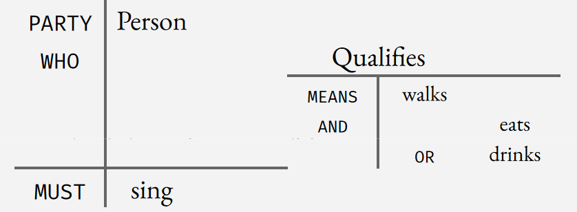
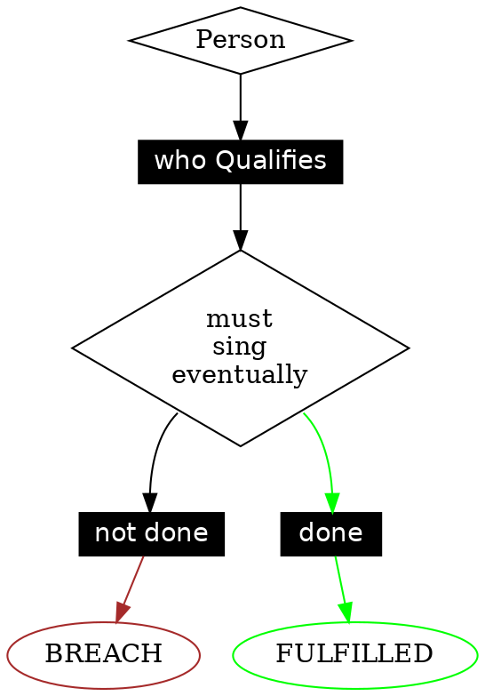

==================
Output
==================

This page goes through the different transpilation targets (web-app, visualisations, model checking etc). These targets appear in the Sidebar as links.

If you don't see the sidebar, please :doc:`see how to get the sidebar show up here <quickstart-installation>`

-----------------------------------------
auto-generation of a web app
-----------------------------------------

This shows up in the sidebar as **View as web app for citizens and customers**.

The Web App might take some time to start up.
If you see errors 502 Bad Gateway after following the link it means app is not set up yet. Try again in a minute or so.

-----------------------------------------

# L4 Rule Engine API Documentation, illustrated using Vue and JSONForms

# System Architecture Overview

The general pattern for this app is that an end-user persona
- logs in to an account with existing user information
- answers questions about a rule
- eventually proceeds to an Outcome tab which displays thee result

The technical contribution of this codebase is to show how the business logic and user interface content can be abstracted away from
UI development.

The upstream encoding of the policy contract in the L4 language is the single source of truth for the user interface form elements and the business logic.

Accordingly, this code base relies heavily on a JSON Schema extracted from upstream L4 to configure a JSON Forms UI flow.

Together with a custom UI Schema, that JSON Forms UI flow controls a user interface session, and produces a JSON object containing the results of the user filling in the form -- `form_data`.

That `form_data` JSON object is fed to a logic engine back-end which returns calculations about claims coverage.

Those calculations are displayed in the UI as the "final answer". This display is organized in a table structurally similar to a shopping cart with items and modifiers adding up to a total sum.

The data flow information architecture of the concrete policy contract implemented in this web app is available at [TODO: link to data flow generated in sidebar]
---
# Form Generation

The web form is configured by a JSON schema, designed to be consumed by JSONForms.

The JSON schema is extracted from the upstream L4 encoding of the original contract.

The L4 encoding produces a **JSON schema**.

This JSON schema will control JSONforms to produce the web app form. In this repository we use JSONforms with Vue. A [React](https://jsonforms.io/api/react/) implementation is also available for JSONforms.

This will produce one unbroken form with default styling with the default UI schema. It is likely necessary to write a [custom uischema](https://jsonforms.io/docs/uischema/). For the Vue build, we found it necessary to write a custom Renderer as well for single object properties, however we believe this already exists for the React implementation of JSONForms. Before deciding how best to do this, however, please read through "UI Display Text for the form" section below.

Together, the UI Schema and the JSON Schema control the web application.

---

# Logic Engine backend API client

The API for querying the logic engine backend ("LE backend") is implemented in Clojurescript
[in this other directory](../joe/insurance/logic-programming/le-webform-glue/).
This is compiled to [le_api_client.js](./src/components/LE/le_api_client.js),
a js file containing an ESM module which exports a js interface to interact
with the LE backend.

The LE backend is queried like this:

```javascript
const resp = await query_le_js(
  "http://cclaw.legalese.com:9999",
  program,
  form_data,
  query
);
```

The query to the logic engine is labeled "Schema 2" in the accompanying web app architecture diagram.

## Arguments

The first argument `cclaw.legalese.com:9999` URL is a development endpoint.

A stable production endpoint will be hosted at `https://prod.cclaw.legalese.com/port/9999/`. See the next section _Backend Endpoint Configuration_ for backend server details.

The `program` argument includes the compiled L4 contract as a single string. This will be provided in this repo and for the purposes of UI development can be treated as a constant black box.

The `query` argument contains a specific "prompt" to the `program` and can also be treated as a constant black box.

Content for the above arguments is available in the [`public/le/`](./public/le/) directory.

The `form_data` argument is the JSON instance that contains the data from the web form UI. As you had saved the data to store as the user fills in the form, the form_data is your loaded object from your store. This is the only data that is provided by the user.

## Return Value

The `query_le_js` function returns a JS object, `resp`. The object can now be viewed and manipulated to display the details from the results we want to display on the website.

This return is represented by the arrow labeled "Schema 3 / outcomes" in the accompanying web app architecture diagram.

_le_api_client.js_ must be imported, and the relevant function _query_le_js_ imported and referenced, for example:

```javascript
import { query_le_js } from "./le_api_client";
```


---

# Backend Endpoint Configuration (Docker)

We have an instance of the LE docker that you can connect to running on our server. The server url is **http://cclaw.legalese.com:9999**

A stable production endpoint will be hosted at `https://prod.cclaw.legalese.com/port/9999/`.

A more detailed explanation of building a local docker image for the LE backend [is detailed here](https://github.com/smucclaw/LogicalEnglish#using-pre-packaged-docker).

---

# Results (Outcome tab)

Your query to the LE backend will look something like this, where `form_data` is the form data you're passing.

    const resp = await query_le_js(
      "http://cclaw.legalese.com:9999",
      program,
      form_data,
      query
    );

_query_le_js_ returns a js object, _resp_.

_resp_ is the raw output that you will receive. These are nested strings. We suggest that you use regex (or string searches) to get the information to display in the **Outcomes** page.

Please :doc:`see here for an example<webform>`, including explanations on how to write L4 for JSON schema and Logical English.

-----------------------------------------
auto-generation of boolean circuit diagrams
-----------------------------------------

This shows up in the sidebar as **View flowchart of regulative rules ("dynamics")**.

==================================
L4 helps you visualise legal logic (docs\early-beta.rst)
==================================

L4 generates convenient visualisations of the logic and the moving parts of your "legal program".

To understand complicated **logic** involving words like "and", "or", "unless": view the *circuit diagram* to see how yes/no verdicts depend on input facts.





To understand complicated **processes** involving *deadlines and obligations*: view the *state diagram* to see how events change state over time, leading to new obligations for parties. Identify a goal and see what you need to do to achieve it.

.. image:: ../images/L4-visualisation-screenshot.png
    :class: with-border

To understand complicated **rule interactions** like *notwithstanding, subject to*: view the *meta-rule analysis* to see how rules interact. (in development)

TODO: explanation of boolean circuit generation

-----------------------------------------
auto-generation of an AST evaluation tree/graph
-----------------------------------------
TODO: explanation of transpilation to ASP tree/graph

-----------------------------------------
auto-generation of software libraries representing the legal logic as operational business logic
-----------------------------------------
**TODO: auto-generation of DMN in sidebar**

-----------------------------------------
auto-generation of natural language
-----------------------------------------
Logical english outputs natural language

This shows up in the sidebar as **Export as Logical English**.

---

Natural language from L4 is generated from L4 rules being transpiled into Grammatical Framework, which can be transliterated to different languages. The transliteration requires concrete grammars to be written for different languages.

This currently shows up in the sidebar as **Export the decision trees as Purescript**.

TODO: further explanation on how to write GF grammars for rules

-----------------------------------------
model checking for property violations
-----------------------------------------
TODO: explanation of model checker

This currently shows up in the sidebar as **Maude plaintext natural4**. You can view it as plaintext, visualise state space or visualise the race conditions.

**UPPAAL** is deprecated but the output exists. If you would like to read about it, please see `this paper <https://github.com/smucclaw/complaw/blob/a8805ff94d43336db95d11baf46e63959dd8f128/Publications/Papers/Waicom2022/pdpa.tex>`_.

-----------------------------------------
tests: property based testing, specific scenario tests, unit tests
-----------------------------------------
TODO: testing framework for L4

-----------------------------------------
useful compiler warnings and error messages
-----------------------------------------
TODO: collate compiler warnings and error messages as they occur