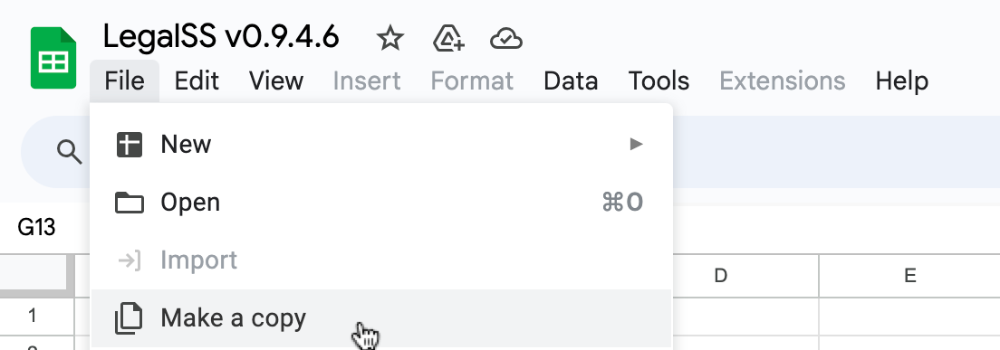
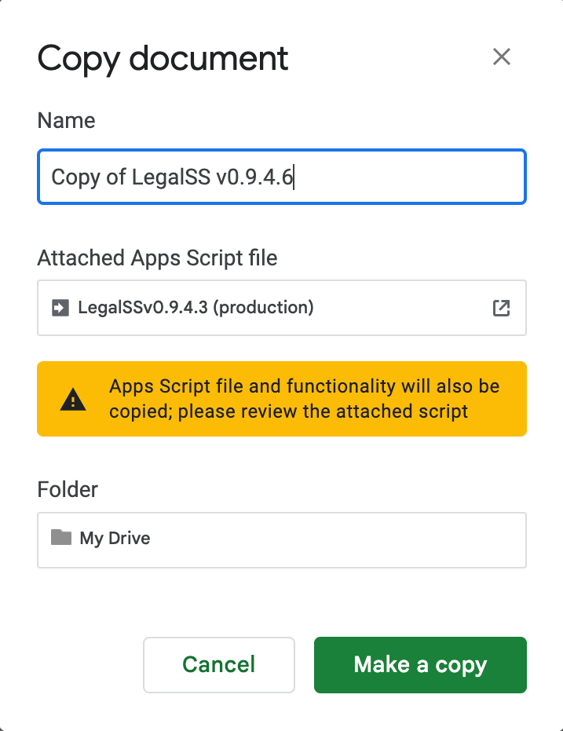
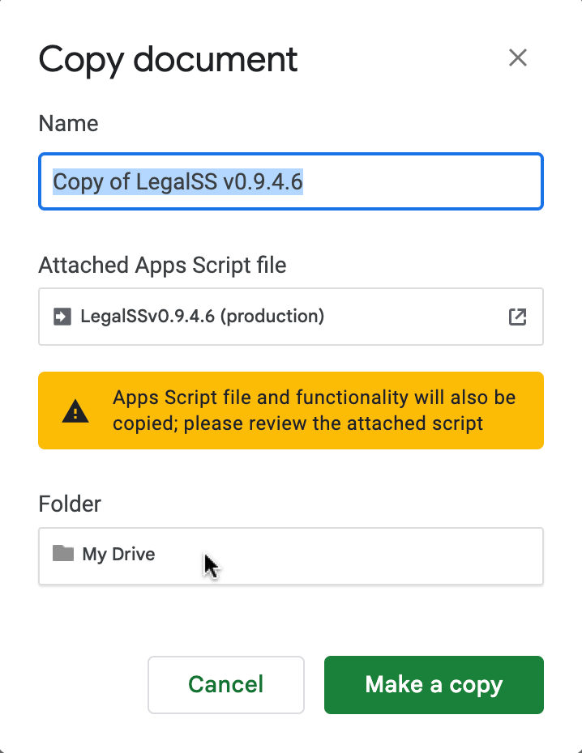
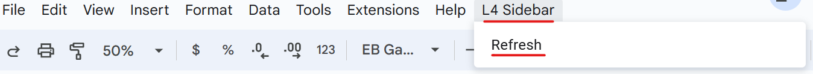

##########
Setting Up
##########

* `Writing in L4 on the LegalSS spreadsheet`_
* `Getting the LegalSS spreadsheet working on your computer`_

  * `0. Prerequisites before you can set up the LegalSS Spreadsheet`_
  * `1. Make a copy of the spreadsheet`_
  * `2. Choose where you want to copy the LegalSS spreadsheet`_
  * `3. Generate the sidebar`_
  * `Contact the L4 developers for help`_

* `Familiarise yourself with the LegalSS Spreadsheet`_
* `Next Steps`_

****************************************
Writing in L4 on the LegalSS spreadsheet
****************************************
|

Your main interface when writing with L4 is on a google sheets spreadsheet called the |LegalSS_spreadsheet|. This spreadsheet has a special app function that activates the L4 language.

The current version of the |LegalSS_spreadsheet| is v0.9.4.6 as of November 2023.

.. |LegalSS_spreadsheet| raw:: html

  <a href="https://docs.google.com/spreadsheets/d/1WyzDqaVTcicDa2K_mzS_SGtLZL4SnzzfYHUDdtBDxUA/edit#gid=1330895971=" target="_blank" rel="noopener noreferrer">LegalSS spreadsheet</a>

========================================================
Getting the LegalSS spreadsheet working on your computer
========================================================

--------------------------------------------------------------
0. Prerequisites before you can set up the LegalSS spreadsheet
--------------------------------------------------------------

- You will need a google account, which doubles as a gmail account. You can follow the instructions in `www.google.com <https://www.google.com>`_, under "sign up for free".

- You will need to go to |LegalSS_spreadsheet| (clicking on the link will open the spreadsheet in a new window). The spreadsheet works with the 2 most recent versions of:

    1. `Chrome <https://www.google.com/chrome/>`_
    2. `Firefox <https://www.mozilla.org/en-US/firefox/new/>`_
    3. `Microsoft Edge <https://www.microsoft.com/en-us/edge>`_
    4. `Safari <https://www.apple.com/safari/>`_

---------------------------------
1. Make a copy of the spreadsheet
---------------------------------

Make a copy of the |LegalSS_spreadsheet| by clicking **File** > **Make a copy**. 

You should get a pop-up like in the image below. 

You can rename this copy to a name of your choosing, or leave the default name as it is.

--------------------------------------------------------
2. Choose where you want to copy the LegalSS spreadsheet 
--------------------------------------------------------

Choose where you want to copy the spreadsheet. By default, it is copied to "My Drive"

This will be your copy of the |LegalSS_spreadsheet|.

.. _Activate_sheets_ide:

-----------------------
3. Generate the sidebar
-----------------------

When your copy of the |LegalSS_spreadsheet| loads, an "L4" menu item should appear next to the "Help" menu item. This will take some time. Click **L4** > **Refresh** to load the sidebar for the first time. Repeat this whenever you make changes to the spreadsheet.

The sidebar should appear on the right of the page:

.. image:: ../images/sidebar-appears-screenshot.png
    :class: with-border
    :width: 200px

----------------------------------
Contact the L4 developers for help
----------------------------------

If you do not see a sidebar, `contact the L4 developers for help <cclaw@smu.edu.sg>`_.

=================================================
Familiarise yourself with the LegalSS spreadsheet 
=================================================

.. .. image:: ../images/familiarise-yourself-screenshot.png
..     :class: with-border
..     :width: 600px

.. --------------------------------------------------------
.. Orange box: Name of your copy of the LegalSS Spreadsheet
.. --------------------------------------------------------

.. In this screenshot, the name refers to the original name of |LegalSS_spreadsheet|. 

.. You should either see the default name "Copy of LegalSSv0.9.4.6" or the name you have replaced the default name with.

.. ------------------------------------------------
.. Blue box: Sidebar showing activated L4 functions
.. ------------------------------------------------

.. This is the sidebar with L4 functions that you should see after refreshing the sidebar.

.. This sidebar can be scrolled down and contains several sections:

.. - Numbered steps that show how you can use L4's output.

..     - Step 1 links to an external web app that can be used to explore whether a legal rule is fulfilled or breached, depending on what is written in the red box.

..     - Step 2 shows a diagram of the generated legal rule, allowing you to easily refer to whether a legal rule is fulfilled or breached.

..     - Step 3 shows a diagram that is clickable and can be expanded to show the logic of why a legal rule is fulfilled or breached.

..     - Steps 4 to 24 are options for you to export the L4 diagram and results into different formats. See `Exporting L4` for more information

.. - The area below the numbered steps shows a 'debugging' area where you can check the L4 code that you can use to help fix any error you may be facing when writing L4. We are working on creating information about this 'debugging' area.

.. -------------------------------------------------------------
.. Green box: LegalSS spreadsheet tabs linking to other examples
.. -------------------------------------------------------------

.. The LegalSS spreadsheet comes with built-in :ref:`examples <examples>` that you can navigate to with the tabs at the bottom of the page.

.. ------------------------------------------
.. Red box: Environment for writing L4
.. ------------------------------------------

.. This is where you write your L4 code.

.. ----------------------------------
.. Black box: Liquor exercise example
.. ----------------------------------

.. In this particular LegalSS spreadsheet tab is the :ref:`Liquor exercise <Learning L4_exercises>`, given in grey cells. The grey box with words contains comments; these comments will not run as L4 code.

.. The light blue box found in the first column shows you what cell is being selected and that will be edited if you type something. In this example screenshot, a cell highlighted in yellow is selected.

.. You will fill your answer in the cells highlighted in yellow. 

==========
Next Steps
==========

.. Once you have finished installation, consider exploring:

.. - :ref:`Why Use L4? <tour_of_L4>`

.. - :ref:`Learn To Use L4 <examples>`.

..
    =======================================================
    Activating L4 Functions withing the LegalSS spreadsheet
    =======================================================

    A one-time procedure is needed in every separate copy of the `LegalSS spreadsheet <https://docs.google.com/spreadsheets/d/1leBCZhgDsn-Abg2H_OINGGv-8Gpf9mzuX1RR56v0Sss/edit?pli=1#gid=1453008311>`_ to activate the L4 interface within your copy of the `LegalSS spreadsheet <https://docs.google.com/spreadsheets/d/1leBCZhgDsn-Abg2H_OINGGv-8Gpf9mzuX1RR56v0Sss/edit?pli=1#gid=1453008311>`_.

    -----------------------------------
  1. Click on Extensions/Apps Script. 
  -----------------------------------
  .. image:: ../images/apps-script-screenshot.png
      :class: with-border
      :width: 300px

  ---------------------------------
  4. Select the LegalSS Apps Script
  ---------------------------------
  A new tab will open on your browser and you will be asked to select a project to open. Choose the first project "LegalSS...". Do not click on "Untitled Project".

..
  .. image:: ../images/select-project-screenshot.png
      :class: with-border
      :width: 300px

  You should be directed to a page similar to the below screenshot.
..
  .. image:: ../images/apps-script-page-screenshot.png
      :class: with-border
      :width: 600px
..
  -------------------------------------------------
  5. Return to your copy of the LegalSS Spreadsheet
  -------------------------------------------------
..
  When the Apps Script page loads, go back to your copy of `LegalSS spreadsheet <https://docs.google.com/spreadsheets/d/1leBCZhgDsn-Abg2H_OINGGv-8Gpf9mzuX1RR56v0Sss/edit?pli=1#gid=1453008311>`_ in your browser and select the tab "PDPA DBNO", which is the first tab of the `LegalSS spreadsheet <https://docs.google.com/spreadsheets/d/1leBCZhgDsn-Abg2H_OINGGv-8Gpf9mzuX1RR56v0Sss/edit?pli=1#gid=1453008311>`_.
..
  .. image:: ../images/advanced-selection-screenshot.png
      :class: with-border
      :width: 500px

  .. _step_6:
..
  -------------------------------------------------
  6. Return to the Apps Script page and click "Run"
  -------------------------------------------------
..
  Back in the Apps Script page, click "Run" to execute the function. 
..
  You will have to grant permission to the App Script to make changes to Google Sheets.
..
  .. image:: ../images/select-run-on-sheet-ide-screenshot.png
      :class: with-border
      :width: 500px

  An Execution Log should appear below the App Script. 

  .. _step_7:
..
  --------------------------------------------------------
  7. Ensure the Apps Script worked has executed completely
  --------------------------------------------------------
..
  Wait until you read "Execution Completed", highlighted in yellow, before you move on to the next step.
..
  .. image:: ../images/execution-completed-screenshot.png
      :class: with-border
      :width: 500px

  ----------------------------------------------------------------------------------------------------
  8. Return to your copy of the LegalSS Spreadsheet and check that the sidebar has activated correctly
  ----------------------------------------------------------------------------------------------------
..
  Return to your copy of the `LegalSS spreadsheet <https://docs.google.com/spreadsheets/d/1leBCZhgDsn-Abg2H_OINGGv-8Gpf9mzuX1RR56v0Sss/edit?pli=1#gid=1453008311>`_. You should see a sidebar appear on the right side of the page. 
..
  .. image:: ../images/sidebar-appears-screenshot.png
      :class: with-border
      :width: 300px