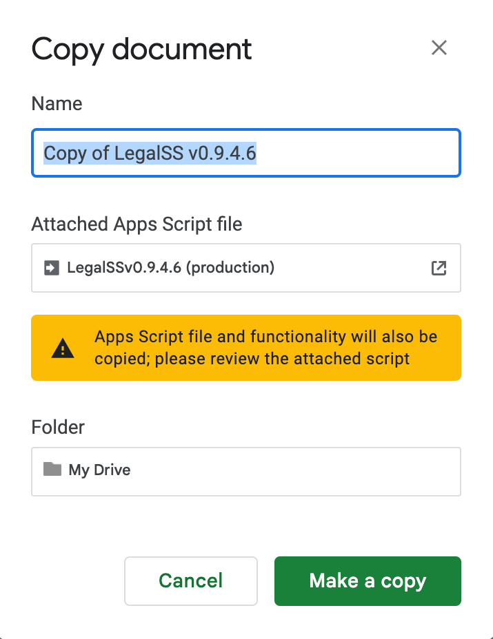
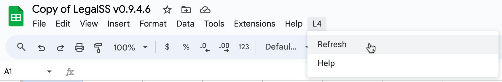

###################################################################
Quickstart: Getting orientated in the L4 spreadsheet user interface
###################################################################

The main interface for writing L4 is a Google Sheets spreadsheet, the |LegalSS_spreadsheet|. (The current version of the |LegalSS_spreadsheet| is v0.9.4.6 as of November 2023.)

This tutorial walks you through setting that up, so that you can write L4.

* `Getting the LegalSS spreadsheet working on your computer`_
* `Familiarise yourself with the LegalSS Spreadsheet`_
* `Next Steps`_

.. |LegalSS_spreadsheet| raw:: html

  <a href="https://docs.google.com/spreadsheets/d/1WyzDqaVTcicDa2K_mzS_SGtLZL4SnzzfYHUDdtBDxUA/edit#gid=1330895971=" target="_blank" rel="noopener noreferrer">LegalSS spreadsheet</a>

========================================================
Getting the LegalSS spreadsheet working on your computer
========================================================

--------------------------------------------------------------
1. Set up a Google account, if you don't already have one
--------------------------------------------------------------

You need a Google account to write L4.

If you do not already have one, you can create one by following the instructions at `Create a Google Account <https://support.google.com/accounts/answer/27441?hl=en/>`_.

------------------------------------------------------
2. Open the |LegalSS_spreadsheet| in a new browser tab
------------------------------------------------------

- Open |LegalSS_spreadsheet| (clicking on the link will open the spreadsheet in a new window)
- and then follow the instructions in that spreadsheet.

The spreadsheet works with the 2 most recent versions of:

    1. `Chrome <https://www.google.com/chrome/>`_
    2. `Firefox <https://www.mozilla.org/en-US/firefox/new/>`_
    3. `Microsoft Edge <https://www.microsoft.com/en-us/edge>`_
    4. `Safari <https://www.apple.com/safari/>`_

We will also summarize the instructions below, but it will probably be easier to focus on the spreadsheet and follow the instructions in it, instead of having to look back and forth.

----------------------------------------------------------------------------
3. What to do, once you have |LegalSS_spreadsheet| open in a new browser tab
----------------------------------------------------------------------------

Again, it will probably be easier to focus just on the spreadsheet and follow the instructions in it. But we will also summarize the most important instructions below, just in case (the spreadsheet will go into more detail).

------------------------------------------------------------------------------------
a. Make a copy of the |LegalSS_spreadsheet| by clicking **File** > **Make a copy**. 
------------------------------------------------------------------------------------

You should get a pop-up like in the image below. 

You can rename this copy to a name of your choosing, or leave the default name as it is.

--------------------------------------------------------
b. Choose where you want to copy the LegalSS spreadsheet 
--------------------------------------------------------

Choose where you want to copy the spreadsheet. By default, it is copied to "My Drive".

.. image:: ../images/choose-where-to-clone-project.png
    :class: with-border
    :width: 300px

This will be your copy of the |LegalSS_spreadsheet|.

.. _Activate_sheets_ide:

-----------------------
c. Generate the sidebar
-----------------------

When your copy of the |LegalSS_spreadsheet| loads, an "L4" menu item should appear next to the "Help" menu item. This will take some time. Click **L4** > **Refresh** to load the sidebar for the first time. Repeat this whenever you make changes to the spreadsheet.

  
The sidebar should appear on the right of the page:

.. image:: ../images/sidebar-appears-screenshot.png
    :class: with-border
    :width: 200px

----------------------------------
Contact the L4 developers for help
----------------------------------

If you do not see a sidebar, `contact the L4 developers for help <cclaw@smu.edu.sg>`_.

But, again, note that the spreadsheet contains more detailed set-up instructions.

=================================================
Familiarise yourself with the LegalSS spreadsheet 
=================================================

.. image:: ../images/familiarise-yourself-screenshot.png
     :class: with-border
     :width: 600px

--------------------------------------------------------
Orange box: Name of your copy of the LegalSS Spreadsheet
--------------------------------------------------------

In this screenshot, the name refers to the original name of |LegalSS_spreadsheet|. 

You should either see the default name "Copy of LegalSSv0.9.4.6" or the name you have replaced the default name with.

.. ------------------------------------------------
.. Blue box: Sidebar showing activated L4 functions
.. ------------------------------------------------

.. This is the sidebar with L4 functions that you should see after refreshing the sidebar.

.. This sidebar can be scrolled down and contains several sections:

- Numbered steps that show how you can use L4's output.

  - Step 1 links to an external web app that can be used to explore whether a legal rule is fulfilled or breached, depending on what is written in the red box.

  - Step 2 shows a diagram of the generated legal rule, allowing you to easily refer to whether a legal rule is fulfilled or breached.

  - Step 3 shows a diagram that is clickable and can be expanded to show the logic of why a legal rule is fulfilled or breached.

  - Steps 4 to 24 are options for you to export the L4 diagram and results into different formats. See `Exporting L4` for more information

  - The area below the numbered steps shows a 'debugging' area where you can check the L4 code that you can use to help fix any error you may be facing when writing L4. We are working on creating information about this 'debugging' area.

-------------------------------------------------------------
Green box: LegalSS spreadsheet tabs linking to other examples
-------------------------------------------------------------

The LegalSS spreadsheet comes with built-in :ref:`examples <examples>` that you can navigate to with the tabs at the bottom of the page.

------------------------------------------
Red box: Environment for writing L4
------------------------------------------

This is where you write your L4 code.

----------------------------------
Black box: Liquor exercise example
----------------------------------

In this particular LegalSS spreadsheet tab is the :ref:`Liquor exercise <Learning L4_exercises>`, given in grey cells. The grey box with words contains comments; these comments will not run as L4 code.

The light blue box found in the first column shows you what cell is being selected and that will be edited if you type something. In this example screenshot, a cell highlighted in yellow is selected.

You will fill your answer in the cells highlighted in yellow. 

==========
Next Steps
==========

Once you have finished installation, consider exploring:

- :ref:`Why Use L4? <tour_of_L4>`

- :ref:`Learn To Use L4 <examples>`.

