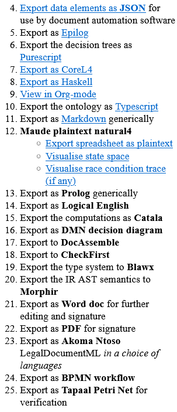

====================================
Exporting L4 Output to Other Formats
====================================

L4 output can be transpiled ('translated') into other languages, both programming and non-programming languages.

You can choose the language to transpile L4 output to through the sidebar.

Scroll down the sidebar until you see point 4: "Export data elements as JSON". This is the beginning of the list of languages L4 output will eventually be able to transpile to.

Only the export links highlighted in blue are currently available.

Refer to the image below for reference as to what you should see in the sidebar.

-----------------
Available Outputs
-----------------

    - JSON

    - :doc:`JSON Schema <transpilers-json-schema>`

    - Epilog

    - Purescript

    - CoreL4

    - Haskell

    - Org-mode

    - Typescript

    - Markdown

    - Maude

      - Plaintext Maude
      - Visualisation of state space
      - Visualisation of race condition trace (if any)

    - :doc:`Logical English <transpilers-logical-english>`

    - :doc:`Web form <webform>`

      This utilises the ``JSON Schema`` and ``Logical English`` outputs.

    - Word Doc (Word Document)

    - PDF

---------------------------
Languages Not Yet Available
---------------------------

    - Prolog

    - Catala

    - DMN decision diagram

    - DocAssemble

    - CheckFirst

    - Blawx

    - Morphir

    - Akoma Ntoso

    - BPMN workflow

    - Tapaal Petri Net

